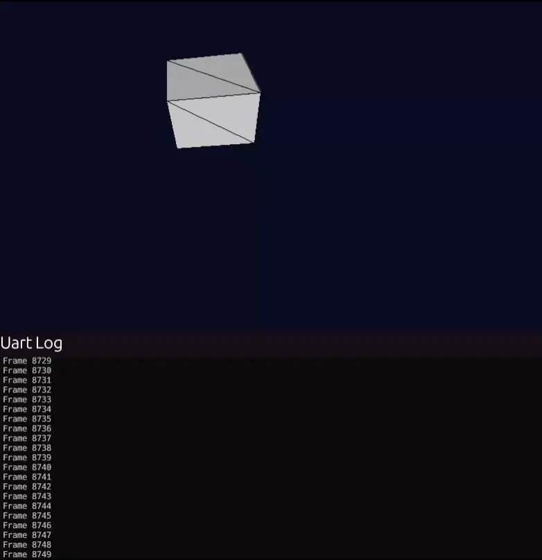
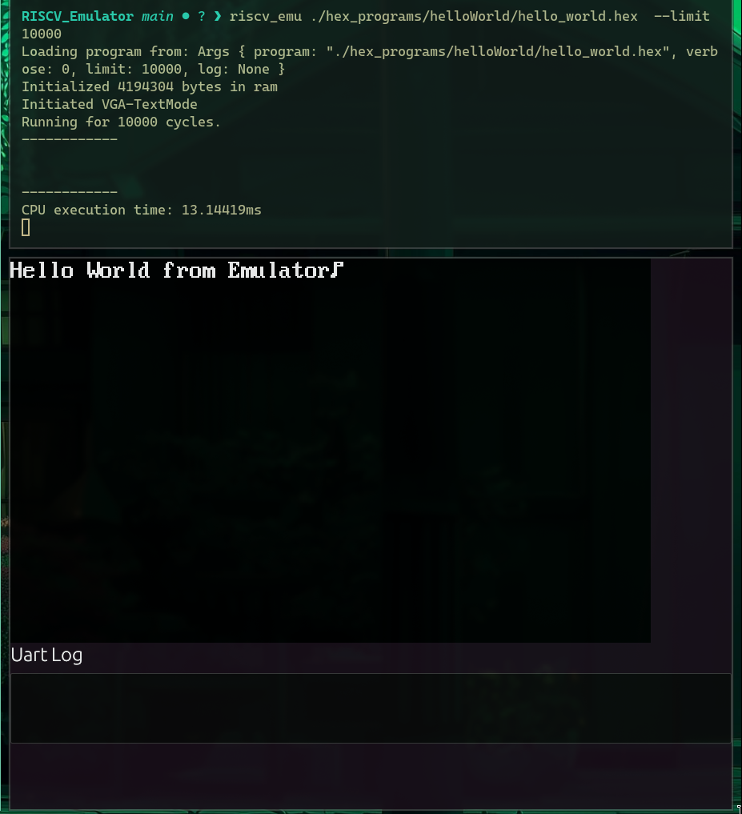
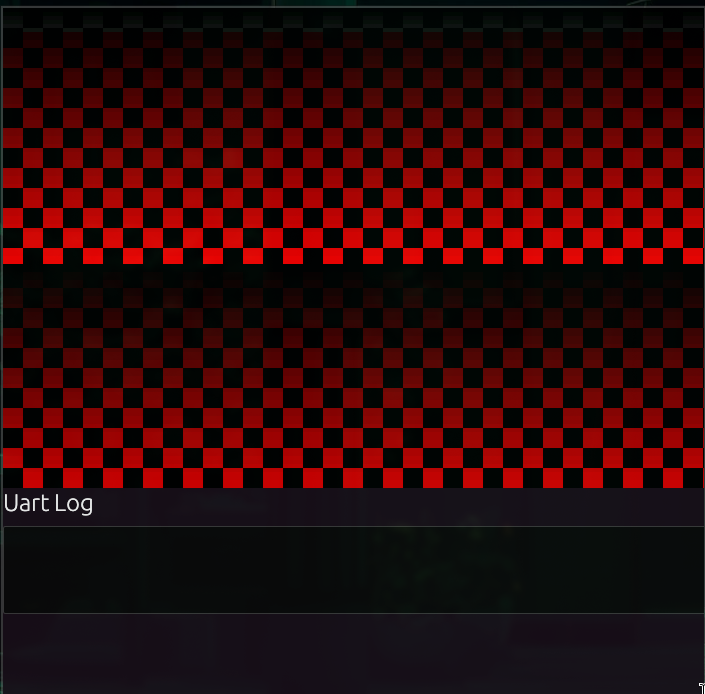

# RISC-V Emulator

<center>
  
</center>

This emulator's main goal is to facilitate emulation of the <a href="https://github.com/Nanousis/RiscY">RISC-Y</a> SoC. It has been made rather modular to allow for any form of peripheral type to be added including different memory hierarchy and further peripherals for emulation.


## Basic Example
To run you can use cargo. 
```
cargo run --release ./hex_programs/uart_test.hex --limit 27000000  
```

### Arguments

`<hex_file>` the file containing the assembly. The original PC is set in the main.rs (0x8000_0000).

`--limit <instr_num>` to run <instr_num> instructions. If it is 0 then you can run instruction by instruction by pressing enter.

`--log <log>.bin` In order to Log the execution of the emulated CPU you can enable the log flag. This logs every instruction with 14Bytes per instruction.

# Log Analyzer
This repository also enables logging each instruction that was executed by the emulated CPU in order to compare with RTL logs. The log produced is binary only the important pieces of informations needed to crossreference and verify the correctness of the execution of a CPU. 

A further python script has been made to compare two log files for differences. This script is found at ./log_analyzer/log_analyzer.py and can be run with `python log_analyzer.py <emu.bin> <rtl.bin>`

# Performance
On a AMD Ryzen 9 7900X3D cpu, the performance of the Emulator is 200MI/s. In case the user is logging the instructions, you are limited by the bandwidth of the disk. In the case of an SSD with 600MB/s the total speed of the Emulator is 42MI/s. Great care has been put into logging only important data required for reproducibility but also small enough to not hinder the execution.

# Compiling for the Emulator and the RISC-Y SoC

To compile for the emulator you can either make your own linker script for baremetal that has the RAM at 0x8000_0000 (changable inside the main.rs function) or use the compile project found at the <a href="https://github.com/Nanousis/RiscY/tree/main/riscYcompiler/main_compiler"> RISC-Y SoC Directory </a>. Please keep in mind that for now the emulator only accepts .hex files and not .elf files. In any case the compiler produces both.

# Screen Rendering

The emulator provides both VGA-TextMode (colors are different from spec) and Framebuffer implementation. 

### Textmode

The VGA Text mode is the default screen mode found in the emulator. It is enabled by setting the Memory Mapped register **0x88002800** to 0. You can write to the text mode buffer by writing at **0x88000000**. The resolution of the screen in textmode is 64\*24 although the screen is cropped to 50\*24

This can be changed by changing the `textmode.rs` script.
<center>
  
</center>

Example of the Hello World program found at `./hex_programs/helloWorld/hello_world.hex`.

### FrameBuffer

The Framebuffer implementation is the second mode of the Emulator's screen output. It can be enabled by setting the Memory Mapped register **0x88002800** to 1. Along with that you can set the framebuffer's start address to any valid address in memory by writting the address to **0x88002804**. This allows for double buffering to avoid seing the frame being drawn in real time. Great effor has been made to minimize the delay for reading the framebuffer from the script. Keep in mind the display offers 16bit colors with the format of 565RGB.

<center>
  
</center>

Example of using the framebuffer program found at `./hex_programs/frame_buffer_test/test.hex`.

Another example of the framebuffer being used is the example that can be seen at the start of this README.md. It can be found at `./hex_programs/lighted_cube/program.hex`.


# UART

The emulator also offers a uart window where you can see logs from the program written inside the uart. Simply write a byte to **0x1000_0000** to write to the uart. You can see an example of uart at the video at the start of this document.

# TODOs

- **Elf loader**: Implement an .ELF loader to load applications directly from an .elf file.
- **Enable Verbosity**: Re enable the cpu to print the instruction currently being executed in human readable format. This was removed from a previous version due to big performance hit.
- **Further Extensions**: Implement further RISC-V Extensions including but not limited to the M and F extension.
- **ZiCSR / Priviledged Execution**: Implement CSRs and traps on the cpu for priviledged execution of the cpu.

